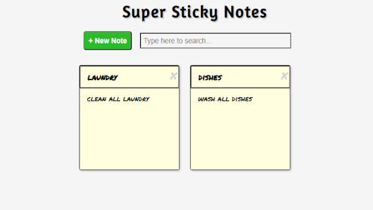

# github-repo-gallery
# Skillcrush Project - Github Repo Gallery Project

This is a tutorial project I completed with Skillcrush. I followed the instructions given by Skillcrush to create this website that uses the github api to load repositories that are on my github profile.

## Table of contents

- [Overview](#overview)
  - [The challenge](#the-challenge)
  - [Screenshot](#screenshot)
  - [Links](#links)
- [My process](#my-process)
  - [Built with](#built-with)
  - [What I learned](#what-i-learned)
  - [Continued development](#continued-development)
- [Author](#author)

## Overview

### The challenge

Users should be able to:

- View the optimal layout for each page depending on their device's screen size
- See hover states for all interactive elements throughout the site
- Make selections to create a coffee subscription and see an order summary modal of their choices at the bottom of the page
- When click Create your plan have a modal with the order summary and an update monthly price depending on selections made by the user.

### Screenshot



### Links

- Live Site URL: [Cofferoasters Site](https://heathersmanski.com/github-repo-site/)

## My process

### Built with

- JavaScript
- Visual Studio Code
- Github API

- Skillcrush provided the HTML and CSS while I wrote the JavaScript by following the code instructions to create this project.

### What I learned

- I learned how to get API information using async and await.

```js
// Fetch API Github profile
const githubUserInfo = async function () {
  const gitusername = await fetch(`https://api.github.com/users/${username}`);
  const data = await gitusername.json();
  console.log(data);
  showUserInfo(data);
};
githubUserInfo();
```
- To fetch the repos I used another async and await

```js
// Fetch Github Repos
const fetchRepos = async function () {
  const gitRepos = await fetch(
    `https://api.github.com/users/${username}/repos?sort=update&per_page=100`
  );
  const repoData = await gitRepos.json();
  console.log(repoData);
  displayRepos(repoData);
};
```
- To display the github user information I used a function to use the data retrieved and show it on the website

```js
// Display User Information
const showUserInfo = function (data) {
  const div = document.createElement("div");
  div.classList.add("user-info");
  div.innerHTML = `
    <figure>
      
    </figure>
    <div>
      <p><strong>Name:</strong> ${data.name}</p>
      <p><strong>Bio:</strong> ${data.bio}</p>
      <p><strong>Location:</strong> ${data.location}</p>
      <p><strong>Number of public repos:</strong> ${data.public_repos}</p>
    </div>
  `;
  overview.append(div);
  fetchRepos();
};

```

### Continued development

I learned about API's in this project and am going to keep learning more about API's and how to best utilize them in websites.

## Author

- Website - [Heather Smanski](https://heathersmanski.com/)
